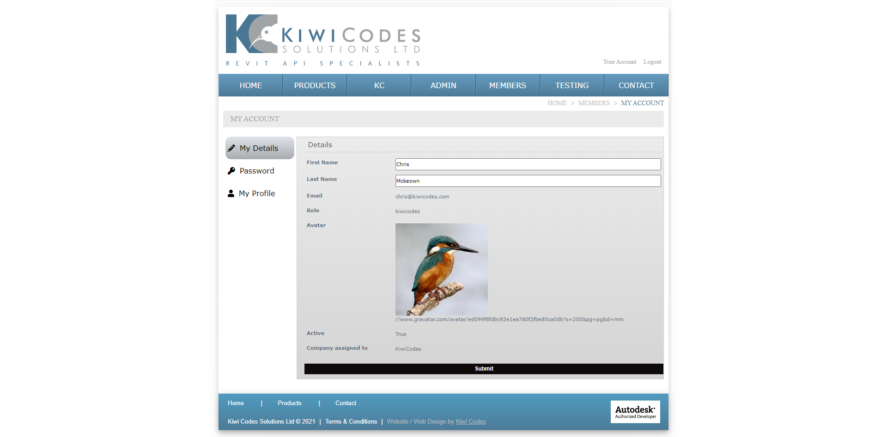
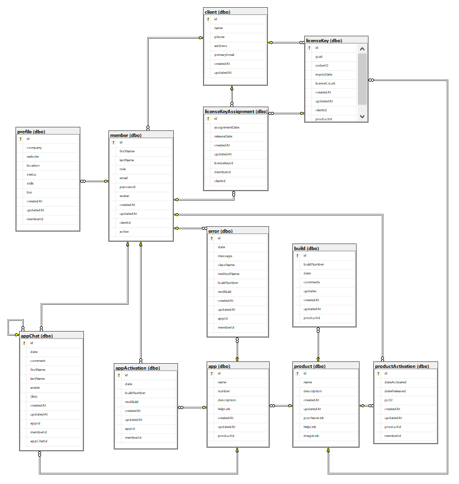

# Kiwi Codes Licensing


[](https://github.com/chrisjmckeown/kiwicodes_licensing/blob/master/LICENSE)[](https://GitHub.com/chrisjmckeown/kiwicodes_licensing/graphs/contributors/)[](https://GitHub.com/chrisjmckeown/kiwicodes_licensing/pull/)

## Description

A portal for clients to manage licenses including license assignment. Also a portal for all to view Kiwi Codes Apps and Tools, to like and comment.

## Table of Contents

- [Installation](#Installation)
- [Usage](#Usage)
- [License](#License)
- [Contributing](#Contributing)
- [Tests](#Tests)
- [Questions](#Questions)

## Installation

1. Download and install [Node.js](http://nodejs.org/) (that will install npm as well)
2. CD to client folder.
3. Install the dependancies.<br />
   ```
   npm install
   ```
4. You are done for the setup, run the app using
   ```
   npm run dev
   ```

### Technologies Utilized


   

## Usage

Once installed:

- To run the Google Book Search locally, use:

```
   npm run dev
```

<h3>Site intent:</h3>

- Mimic an existing [Kiwi Codes website](http://www.kiwicodes.com/) to maintain consistancy for clients, replicating the Home, Products, and Contact pages.

- Kiwi Codes develops products/apps to enhance [Autodesk Revit](https://www.autodesk.com.au/collections/architecture-engineering-construction/overview?mktvar002=4187437|SEM|11508955582|112583906619|kwd-297275816631&panel=buy&ef_id=Cj0KCQjw0oCDBhCPARIsAII3C_EP5tGiUaDC2Z-5qn6HvZpVnYss2dN80K93XvFGOLpqHhztjfZHltMaAgJcEALw_wcB:G:s&s_kwcid=AL!11172!3!476209079026!e!!g!!autocad%20revit!11508955582!112583906619&gclid=Cj0KCQjw0oCDBhCPARIsAII3C_EP5tGiUaDC2Z-5qn6HvZpVnYss2dN80K93XvFGOLpqHhztjfZHltMaAgJcEALw_wcB&term=1-YEAR), a desktop application used within the AEC industry to design and document buildings. Autodesk have and [app store](https://apps.autodesk.com/RVT/en/Home/Index) for developers to list and sell their products.

- Kiwi Codes Products contain 1 or more App. [Bonus Tools](https://apps.autodesk.com/RVT/en/Detail/Index?id=2077603980990329161&appLang=en&os=Win64), contains 150+ Apps.

- The purpose of this Kiwi Codes Licensing portal is to create and manage clients & licenses, record product errors, and view product and app usage.

- There are 4 levels of permission:

  - Public
    - Pages visible to all include Home, Products, and Contact
  - Kiwi Codes Admin
    - As clients purchase products via an ecommerce platform, Kiwi Codes Admins can:
      - Manage Clients
        - Create a Client
        - Assign a Client Admin
        - Create a License Key upon purchase
          - Clients can puchase 1 or more license keys.
      - Manage Members
        - Edit details, including toggling active (true/false) instead of deleting.
      - Manage Products
        - Add and edit product details
      - Manage Apps
        - Add and edit app details and assign to Products.
      - Manage Errors
        - Errors a sent from Autodesk Revit desktop app via a RESTAPI call and stored against the Member, Client and App, to help debug and improve the apps.
      - View Product and App usage
        - To review and develop the most used apps.
      - View Audits
        - Audits are a set of harvested data from the Autodesk Revit file sent via a RESTAPI call. They are recorded so clients can view results online and make decisions on how to best maintain a document.
  - Company Admin
    - Once a Client has been created by Kiwi Codes they can:
      - Manage License Keys
        - Assign members to a license key (Product) so the member can use an app(s).
      - Manage Members
        - Add new members
        - Assign members to a license key (Product) so the member can use an app(s).
      - View Product and App usage
        - Check which apps use the most to provide internal training and promot other usefull apps.
      - View Audits
        - Audits are a set of harvested data from the Autodesk Revit file sent via a RESTAPI call. They are recorded so clients can view results online and make decisions on how to best maintain a document.
  - Members
    - Members can
      - View Product and App usage
        - Check which apps they use the most
      - View Audits
        - Audits are a set of harvested data from the Autodesk Revit file sent via a RESTAPI call. They are recorded so clients can view results online and make decisions on how to best maintain a document.
      - App chat
        - Members can comment on Apps, leaving likes and dislikes for Kiwi Codes Admin to review.

My Account page:


Database Diagram:


### Deployment

View the deployed app here: [deployed app](http://kiwi-codes.com/)

## License

Pull requests are welcome. For major changes, please open an issue first to discuss what you would like to change.

[](https://github.com/chrisjmckeown/kiwicodes_licensing/blob/master/LICENSE)

## Contributing

[](code_of_conduct.md)

## Tests

TBA

## Questions

- Follow me at: <a href="https://github.com/chrisjmckeown" target="_blank">https://github.com/chrisjmckeown</a>
- Please email with any question at: chris.j.mckeown@hotmail.com

© 2021 chrisjmckeown
